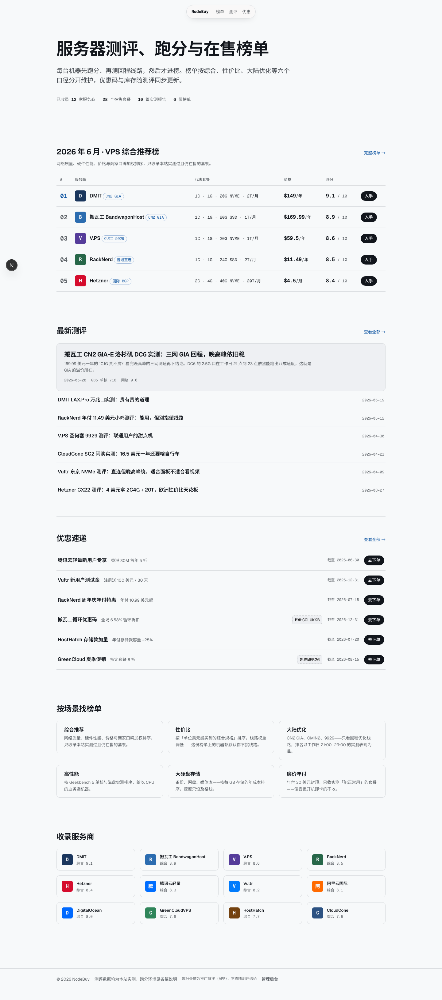
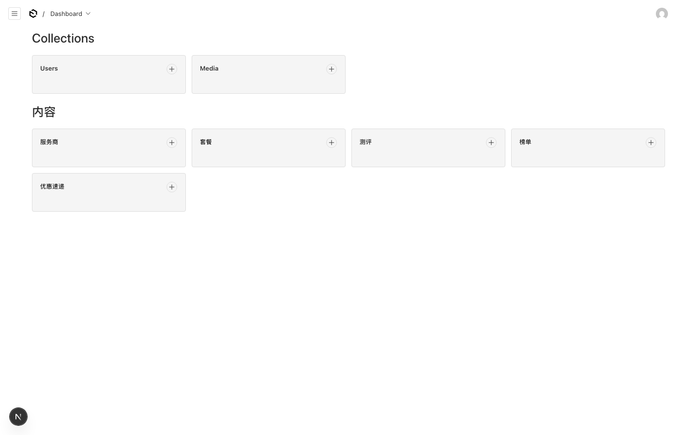

# NodeBuy · 服务器测评与榜单

基于 **Payload CMS 3 + Next.js 16 + PostgreSQL** 的服务器测评 / 榜单 / AFF 推广站。
前台为测评内容站，后台为 Payload 独立管理面板，所有内容（服务商、套餐、测评、榜单、优惠码）均可在后台维护。

> 📚 完整文档见 `docs/`：[开发手册](docs/开发手册.md) · [部署手册](docs/部署手册.md) · [使用手册](docs/使用手册.md)，更多界面截图见 `screenshots/`。

| 前台首页 | 管理后台 |
| --- | --- |
|  |  |

## 技术栈

- **Payload CMS 3.85**（`@payloadcms/db-postgres` + Lexical 富文本）
- **Next.js 16**（App Router，前后台同仓同进程）
- **PostgreSQL 16**（Docker，宿主端口 `5434`）
- **TypeScript 5.7 / pnpm**，测试：Vitest（集成）+ Playwright（E2E）
- 设计系统：Hallmark · modern-minimal / Quiet 主题（`src/app/(frontend)/tokens.css`）

## 本地启动

```bash
# 1. 启动数据库
docker compose up -d

# 2. 安装依赖
pnpm install

# 3. 环境变量
cp .env.example .env   # 按需修改 PAYLOAD_SECRET

# 4. 灌入演示数据（12 服务商 / 28 套餐 / 10 测评 / 6 榜单 / 9 优惠）
npx tsx src/seed.ts

# 5. 启动
pnpm dev
```

- 前台：<http://localhost:3000>
- 后台：<http://localhost:3000/admin>（种子管理员 `admin@nodebuy.local` / `nodebuy123`）

> 种子脚本必须用 `npx tsx src/seed.ts` 运行（`payload run` 会静默失败），且有幂等保护：已有数据时直接跳过，重置请清空数据库后重跑。

## 目录结构

```
src/
├── payload.config.ts     # Payload 总配置（集合注册、数据库适配器）
├── payload-types.ts      # 自动生成的类型，不要手改（pnpm generate:types）
├── seed.ts               # 演示数据种子脚本
├── collections/          # 数据模型：Providers / Plans / Reviews / Rankings / Deals / Users / Media
├── components/           # 共享组件（徽标、评分条、AFF 按钮、优惠码复制）
├── lib/labels.ts         # 线路/分类中文映射 + 规格/价格格式化
└── app/
    ├── (frontend)/       # 前台内容站（tokens.css 为全站唯一取色来源）
    ├── (payload)/        # Payload 后台与 REST/GraphQL API
    └── go/[slug]/        # AFF 302 跳转路由
```

## 内容模型

| 集合 | 说明 |
| --- | --- |
| `providers` | 服务商：评分、机房、付款方式、优缺点、**AFF 链接** |
| `plans` | 套餐：规格、价格、线路（CN2 GIA / CMIN2 / 9929…）、库存、套餐级 AFF 链接 |
| `reviews` | 测评：富文本正文 + 跑分（GB5 / 磁盘 / 三网测速 / 回程线路）、草稿版本控制 |
| `rankings` | 榜单：六个分类口径，条目按顺序即名次 |
| `deals` | 优惠速递：优惠码、折扣、有效期 |

## AFF 跳转

`/go/<provider-slug>?plan=<id>` 统一 302 跳转，优先级：套餐级 `affUrl` → 服务商 `affUrl` → 官网。
所有出站推广链接带 `rel="nofollow sponsored"`。在后台改链接即可全站生效，适合做推广域名。

## 路由

| 路径 | 内容 |
| --- | --- |
| `/` | 首页（精选榜 / 最新测评 / 优惠 / 分类榜单 / 服务商索引） |
| `/rankings` `/rankings/[slug]` | 榜单列表 / 详情 |
| `/reviews` `/reviews/[slug]` | 测评列表 / 详情（含跑分表） |
| `/providers/[slug]` | 服务商档案 + 在售套餐 + 相关测评 |
| `/deals` | 优惠速递（优惠码点击复制） |
| `/go/[slug]` | AFF 302 跳转 |
| `/admin` | Payload 管理后台 |

## 常用命令

| 命令 | 说明 |
| --- | --- |
| `pnpm dev` | 开发模式（集合结构自动 push 到数据库） |
| `pnpm build` / `pnpm start` | 生产构建 / 启动 |
| `pnpm lint` | ESLint 检查 |
| `pnpm test` | 全部测试（集成 + E2E） |
| `pnpm test:int` / `pnpm test:e2e` | Vitest 集成测试 / Playwright E2E |
| `pnpm generate:types` | 修改集合后重新生成 `payload-types.ts` |

## 部署

支持 Docker（仓库自带 `Dockerfile`）或任意 Node.js 托管，详见[部署手册](docs/部署手册.md)。生产环境务必：

1. 将 `PAYLOAD_SECRET` 换成强随机值；
2. 配置 `DATABASE_URL` 指向生产 PostgreSQL；
3. 将 `NEXT_PUBLIC_SERVER_URL` 设为站点对外地址。

## License

MIT
